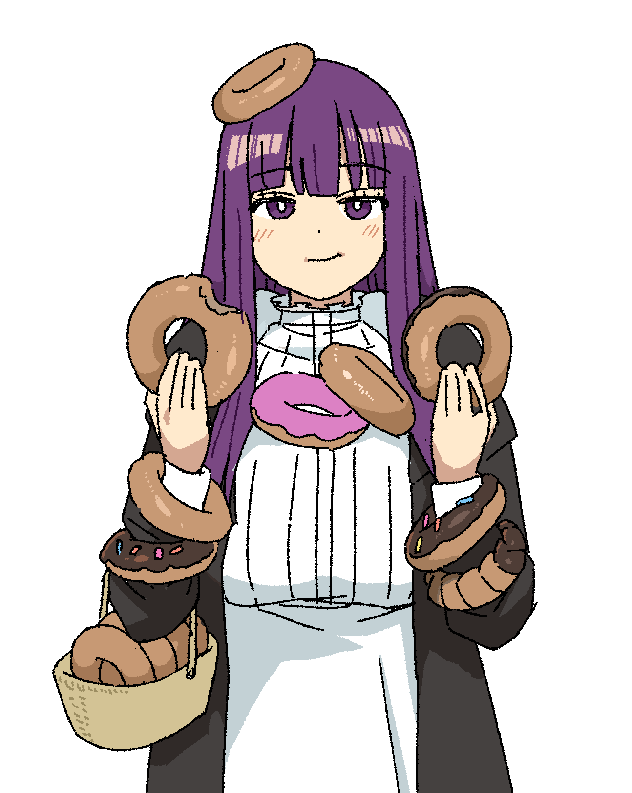

  

  

    <h1><code> クロナミ </code></h1>
    
  

  

    <b>ADHD powered.</b> Building weird and functional stuff. 
  

  

    
    
    
    
    
  

   

  

  
🌷 <b><samp>— プロジェクト —</samp></b> 🌹

  <table border="0">
    <tr>
      <td align="center" width="33%">
        
        <h4>thebeyond</h4>
        
Networking & VPN

      </td>
      <td align="center" width="33%">
        
        <h4>quickpowered</h4>
        
Media & Tools

      </td>
      <td align="center" width="33%">
        
        <h4>snglr</h4>
        
Social Engines

      </td>
    </tr>
  </table>

  

  

  

  

 

  
🏮 <b>「 デジタルアクセス 」</b> 🏮

  

    
  

  
  
   
  
  
  

